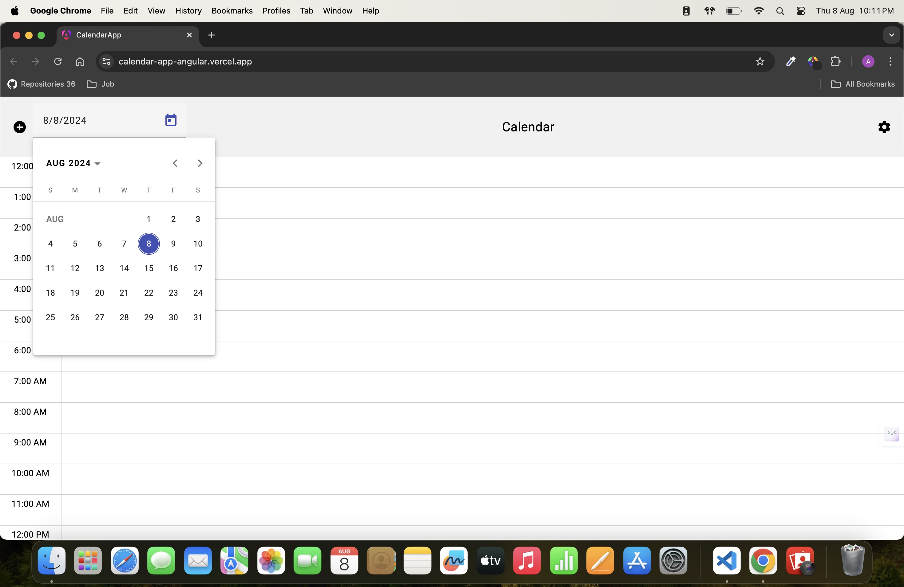
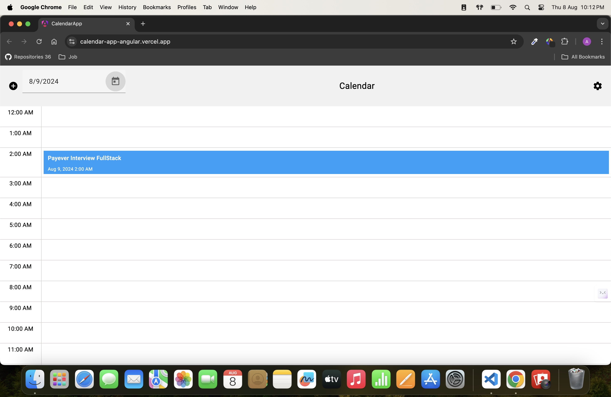

# CalendarApp

This project is a feature-rich calendar application built with Angular. It allows users to manage events, view them by day, and perform CRUD operations on events.

## Features

- **Event Management**: Add, edit, and delete events.
- **Daily View**: View events scheduled for a specific day.
- **Responsive Design**: Optimized for both desktop and mobile devices.
- **Drag and Drop**: Easily move events between different time slots.

## Getting Started

### Prerequisites

- Node.js and npm installed. You can download them from [Node.js](https://nodejs.org/).
- Angular CLI installed globally. You can install it using the following command:
  ```bash
  npm install -g @angular/cli
  ```
 
Development
Ensure the project passes linting:
```bash
ng lint
```
Build the project:
```bash
ng build
```

Serve the application:
```bash
ng serve
```
The application can now be accessed at http://localhost:4200/. 






